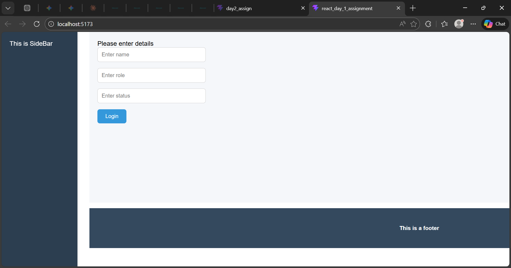

## Login page
This is project was built using Vite with Js and React compiler

## Layout
The UI is divides into 3 sections. Main, Sidebar and Footer.

## Functionality
The application accepts 3 user inputs and updates the main page's content based on these inputs.

## Folder Structure

The project starts from the LoginApp.jsx file and global css isloaded from assets/assets.css

1. src/components - All the components are present here.
2. src/components folder has 2 sub folders common and layout.
3. The common folder contains all the reusable components used throught the project.
4. The layout folder contains the page layout components.

src/
├── assets/
│   ├── assets.css
│   ├── hero.png
│   ├── react.svg
│   └── vite.svg
├── components/
│   ├── common/
│   │   ├── AdminWelcome.jsx
│   │   ├── CustomButton.jsx
│   │   ├── NormalUserWelcome.jsx
│   │   ├── SupportPage.jsx
│   │   └── UserInputBox.jsx
│   └── layout/
│       ├── Footer.jsx
│       ├── MainPage.jsx
│       └── SideBar.jsx
├── App.css
├── App.jsx
├── index.css
├── LoginApp.jsx
└── main.jsx

## Browser views

